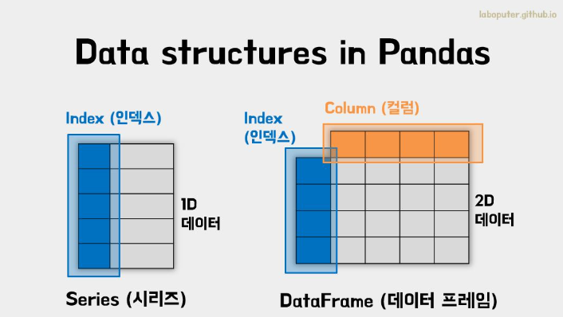

## 1일차 학습
- 빅데이터 학습

### 빅데이터 학습

#### 빅데이터 개요
- 정의
    - 디지털 환경에서 발생하는 대규모의 데이터.
    - 대량의 데이터를 수집, 저장, 관리, 분석하는 HW/SW. >> 유통, 활용까지 포함.
- [특징](https://velog.io/@garam/DE-%EB%B9%85%EB%8D%B0%EC%9D%B4%ED%84%B0%EC%9D%98-%ED%8A%B9%EC%A7%953V-5V-7V)
    - 기존 3V >> 현재 5V (가치 창출이 중요해지면서 추가)
        - 규모, 다양성, 속도 (3V) >>추가>>  정확성, 가치 (5V)
- 기술
    - 순서적으로 데이터 생성 >> 수집 >> 저장 >> 분석(EDA, 머신러닝, 딥러닝) > 표현(시각화)
    - 생성 >> IoT, 빅데이터 플랫폼
    - 수집 >> 빅데이터 플랫폼(하둡, Kafka...etc)
    - 저장 >> 빅데이터 플랫폼(Kafka...etc)
    - 분석, 표현 >> 통계, 머신러닝, 딥러닝, 자연어처리, 패턴처리, 이미지 프로세싱(Spark, Power BI, Tableau...etc)
    - 표현 >> Visualization

#### 학습교재
직장인을 위한 데이터 분석 실무 파이썬, 위키북스

- 실습 자료 : https://github.com/Play-with-data/datasalon

#### 파이썬 리뷰
- 이전 자료 : https://github.com/king-dong-gun/java-bigdata-2024

#### 데이터 분석 기초
데이터 분석을 위한 라이브러리(모듈) 학습부터 시작!!
- Pandas : 데이터 처리 라이브러리
- Numpy : 수치해석, 계산용 라이브러리
- Excel, cvs용 라이브러리 : Excel, CSV, JSON 문서 데이터 로드or저장 라이브러리
- Selenium ; 웹 크롤링 자동화 라이브러리
- BeautifulSoup : 웹 데이터를 정제 라이브러리
- Matplot.lib : 차트 표현 라이브러리
- Seaborn : 시각화 라이브러리 
- Folium : 지도 시각화 라이브러리
- TensorFlow : 머신러닝 라이브러리
- PyTorch : 머신러닝, 딥러닝 라이브러리

추가 내용 >> [Kaggle](https://www.kaggle.com/)

##### Pandas 학습
데이터 분석(로딩, 처리...etc) 라이브러리





1. Pandas 자료구조
    - 데이터프레임, 시리즈
    - [데이터프레임 사용방법](day01/data01_pandas.basic.ipynb)

##### VS Code 문제확인
dataFrame을 사용할때 타이핑이 밀리는 현상 해결방법
```python
1. command + Shift + P
2. config runtime arguments 검색
3. "disable-hardware-acceleration": true 주석 해제
4. 해결!!!!
```

##### VS Code 한글 깨짐 문제확인
```python
cvs 파일에서 한글이 깨지는 현상 해결방법
1. 엑셀 데이터 텝 >> 데이터 >> CSV가져오기 >> 파일선택
2. 파일원본 >> 한국어 -> 유니코드(UTF-8) 설정
3. 해결!!!!
```